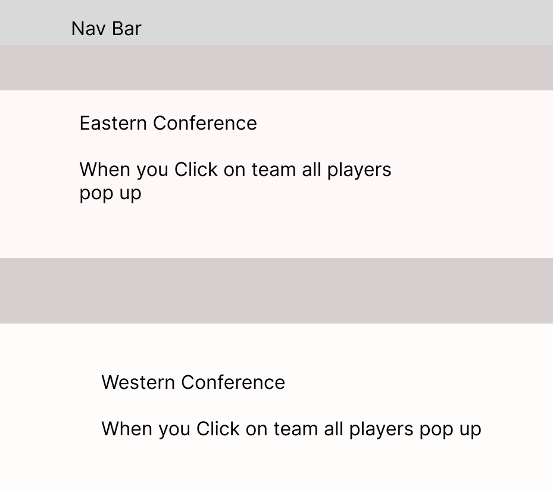

README
GITHUB LINK - https://github.com/allenmor/Phase-2-Project
=======
# NBA REPORT 

github repo :
Our CRUD Routes are
Get: To get the information from the db.json
Post request: To Post the new stadium that the user would like to Post

What three (or more) React Router routes you will be using and what they will be used for
A component diagram specifying the following per component (if any):
The purpose of the component
Any state or state lifting
Any events
Props
An outline of your db.json file including dummy data
Three stretch goals
A Kanban board of how you will be dividing tasks and when they will be done

Website Description
NBA REPORT is a website app that shows all the teams in the Eastern and Western Conference.
It shows all the stadiums. Also a user may input any player they like and get all the players stats for their entire career.

We are using .... React Routes // and what they will be used for
1. First Route - Home Page
This page contains the FrontPage component. Which displays both conferences and all the teams and players in them. Our app is a information Website for NBA fans. You can look at all the teams they are divided by the two conferences.
2. Second Route - Stadiums Page
In the stadiums page contains the Stadiums Component you can get a full view of every stadium that is in the NBA and also after clicking on the image you can
see the full inside look of every stadium you like. You can also create your own stadium and input a name image inside and 
image outside. That stadium will be added to the other 30 stadiums already on the page. It will be a FETCH POST so whatever you add
will persist on the page.
3. Third Route - Search For Player
In the search for player page contains the SearchForPlayer component you can search for any player you like and you will get their entire career stats. YES starting from
the beginning to end of their career you will get a table with every season INCLUDING playoffs which team they played for that year 
how many games they played the amount of points rebounds and assists they averaged for that whole season and also thei Field Goal percentage.
4. The NavBar component lets us navigate through all the pages it is using react router to route to which ever page the user pleases

WIREFRAME

FIRST PAGE

SECOND PAGE

THIRD PAGE

